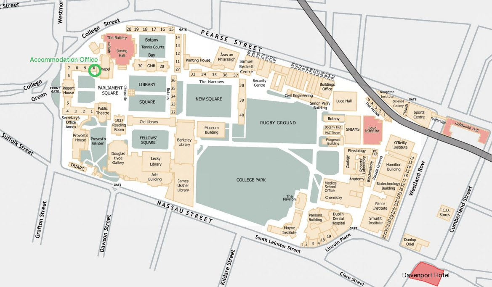

**PLDI 2009: Local Orientation**
================================

.. image:: http://www-plan.cs.colorado.edu/~pldi09/line.gif
   :align: center

Getting there
**************

PLDI 2009 is being hosted by `Trinity College Dublin`_ (TCD) which is located
right in the heart of Dublin City center.

Arriving at Dublin Airport
--------------------------

The good news here is that Dublin has just one small airport, `Dublin
Airport`_. The airport is situated about 15 km north
of Dublin city center. There are two main options for getting from the
airport to the city center:

-  By **taxi**: there's a taxi rank right outside the terminal building
   exit, signposted inside the terminal. Taxi fares are fixed and
   government-regulated so there should be no need for haggling: the fare from
   the airport to the city center is about 20-30 euros (and varies according to
   baggage, time of day etc.)

-  By **bus**: `Aircoach`_ buses run from the airport to the city center,
   stopping outside Trinity College - the fare is		€8 (€12 return). There are
   other busses, but this is the best. You can catch an AirCoach right outside
   the terminal building and purchase tickets as you board. The journey takes
   roughly 30-45 minutes, depending on traffic.

There's no rail link to the airport. The usual car-hire options are available
from the airport (Hertz, Avis, Budget etc.) and they have desks in the terminal
building. If you're not planning to venture outside Dublin during your stay you
might prefer to avoid car hire: Trinity College's central location makes it a
nexus for public transport and traffic jams.

There are ATM machines and currency-exchange kiosks inside the terminal
building if you need to get local currency.

Around Trinity College Dublin (TCD)
-----------------------------------

The **front gate** of Trinity College is the de facto "center" of Dublin
City, and any passer-by will be able to direct you there.

Trinity provides a `visitors page <http://www.tcd.ie/visitors/>`_, with 
`maps of the campus`_. The following map highlights important places in Trinity
in red.

Checking in (TCD accomodation)
~~~~~~~~~~~~~~~~~~~~~~~~~~~~~~

If your accomodation is in Trinity, you need to check in at the Accomodation
Office, West Chapel in Front Square (marked on the map above). The most
convenient entrance is via Front Arch.

Finding the registration desk
~~~~~~~~~~~~~~~~~~~~~~~~~~~~~

-  On Monday, Friday and Saturday the registration desk and all technical
   sessions will be in the Lloyd Institute.

-  On Tuesday, Wednesday, Thursday, the registration desk and all technical
   sessions will be in Goldsmith Hall."

   -  The **Lloyd Institute** is on the east-side of the campus, near
      Westland Row.
   -  **Goldsmith Hall** is also on the east-side of the campus, at the
      junction of Pearse Street and Westland Row.

-  You should allow about 10 minutes to walk to either venue from the
   TCD front gate.

.. image:: http://www-plan.cs.colorado.edu/~pldi09/line.gif
   :align: center

Local Coffee Shops
~~~~~~~~~~~~~~~~~~
The Science Gallery (beside the Lloyd Institute) and Café Napoli (on Westland
Row) both offer great (espresso-based) coffee.

Things to do in Dublin
**********************

The map can give you directions to all of the pubs and restarants we've listed,
as well as some other points of interest.

.. raw:: html

   

      <iframe width="600" height="600" frameborder="0" scrolling="no" marginheight="0" marginwidth="0" src="http://maps.google.com/maps/ms?ie=UTF8&amp;hl=en&amp;oe=UTF8&amp;source=embed&amp;msa=0&amp;msid=104675953497942268374.00046b74151daf2c87166&amp;ll=53.380936,-6.265645&amp;spn=0.090284,0.053484&amp;output=embed"></iframe> <small>View <a href="http://maps.google.com/maps/ms?ie=UTF8&amp;hl=en&amp;oe=UTF8&amp;source=embed&amp;msa=0&amp;msid=104675953497942268374.00046b74151daf2c87166&amp;ll=53.380936,-6.265645&amp;spn=0.090284,0.053484" style="color:#0000FF;text-align:left">PLDI</a> in a larger map</small>
   

Going to the pub is Ireland's major social activity, providing entertainment
and culture (even for non-drinkers). The "round" is very common here - there is
no easier way to identify yourself as a tourist than if 10 people arrive in a
pub and each order their own drinks at the bar.

Modern pubs
-----------

-  **The Pav** (Trinity): The pavillion bar is in Trinity, overlooking the Cricket Pitch. A
   great place to spend a sunny evening, sitting on the grass. Its Trinity
   only, so bring your PLDI badge or you might not get served at the bar.

-  **Bull and Castle** (Christchurch): A gastro-pub with a large selection of
   beers, and amazing food. Just keep walking up Dame St until you reach
   Christchurch.

-  **Messr McGuire** (Brugh Quay): A micro-brewery overlooking the Liffey, with
   an unusual interior.

-  **Market Bar** (Fade St): A former abatoir with massive high ceilings, and a good
   restaurant.

-  **Cafe en Seine** (Dawson St): Though it comes with a slightly pretentious crowd,
   this huge pub has very interesting interiors. Caution: drinks are expensive.

-  **The Secret Bar** (Fade St): This pub opened about a year ago, and doesnt have a name
   above its door.  Its a nice bar, modern, in a large georgian styled
   apartment.  Since its a secret, they dont have a website, but its on Fade
   st, across from the Market Bar. Look for 2 security guys guarding an
   innocuous door with a snail above it.  Its above 'La Gulaton' - a french
   restaurant which also has no name or signage.

-  **Dicey Rileys** (Harcourt St - go through the Russell Court Hotel): With a
   huge outdoor area, this is a great place to spend a sunny evening. They
   occasionally have a BBQ going too.

Traditional pubs
----------------------

-  **O'Neill's** (Pearse St): A great traditional Irish pub, its the nearest pub to the
   conference that we would bother with. There is another O'Neills on Suffolk
   St - we like it too, just not as much.

-  **Porter house** (Parliament St): A micro-brewery famous for its beers. Good
   atmosphere and live music.

-  **O'Donoghues** (Suffolk St): This used to be called Thinge Mote, a viking name
   reflecting Dublins roots. They changed the name and the facade, but we still
   like the pub. Great interior. The other O'Donoghues on Baggot St is also
   pretty good.

-  **Mulligans** (Poolbeg St): Best Guiness in Dublin (and therefore the world, probably). An
   unattractive pub, behind a hideous building on an ugly street. Look behind the Screen Cinema.

-  **Kehoes** (South Anne St): An traditional pub with a young crowd. A lively
   and crowded pub, a great choice just off Grafton St. Good guinness.

-  **Stag's head** (Dame Lane): An old bar with plenty of history. On the
   southside of Dame St, look for the Stag's mural in the pavement, and go through
   the alley.

Clubs
-----

Depends what you're into. Ask the locals (or `the authors`_) during the conference.

Restaurants
------------

Roughly in order of preference.

.. list-table::
   :header-rows: 1
   :widths: 15, 15, 10, 5, 55

   *  -  Restaurant
      -  Address
      -  Phone
      -  Price
      -  Description

   *  -  `Bull and Castle <http://www.fxb.ie/castle_index.html>`_
      -  Castle Inn, Christchurch                            
      -  01 4751122
      -  €€€
      -  Great food, great steak, great beers.

   *  -  `Sinnott's Bar <http://www.sinnotts.ie/>`_                 
      -  South King St                                       
      -  01 4784698
      -  €€
      -  We love Sinnotts. Sadly, they only serve great food at lunch, when
         they provide the best carvery in Dublin. A carvery is traditional
         buffet, with meat, potato (probably multiple kinds), some veg, and
         stuffing and gravy. Amazing, and the only traditional Irish food we
         eat.

   *  -  `Brasserie 66 <http://www.brasseriesixty6.com/>`_          
      -  66 George's Street                                  
      -  01 4005878
      -  €€€
      -  Great European food with a great atmosphere. Reservation probably
         needed. (Look on the website for great offers, but mention them while
         booking).

   *  - `Fire <http://www.mansionhouse.ie/fire.aspx>`_             
      -  The Mansion House, Dawson St                        
      -  01 6767200
      -  €€€€
      -  Great food served in a great location: the Mansion House, home of the
         mayor.

   *  - `Yamamori <http://www.yamamorisushi.ie/>`_                 
      -  71 George's St                                      
      -  01 4755001
      -  €€€
      -  The best - and one of the only - places for Asian food in Dublin,
         including sushi, sashimi and noodle dishes.

   *  - `Wagamama <http://www.wagamama.ie/>`_                      
      -  South King Street                                   
      -  01 4782152
      -  €€
      -  Like Yamamori, but a chain. Still, pretty good, and a bit cheaper.

   *  - `Fallon & Byrne <http://web.fallonandbyrne.net/>`_         
      -  11 Exchequer Street                                 
      -  01 4721000
      -  See description.
      -  Fallon & Byrne has a well regarded restaurant (€€€), an excellent
         take-away lunch counter (€) and a great wine bar (€€€). 

   *  - `Pizza Stop`_                                              
      -  Chatham Lane (beside Westbury Hotel)                
      -  01 6796712
      -  €
      -  An authentic Italian restaurant with great prices and great food.

   *  - `Shanahans on the Green <http://www.shanahans.ie>`_        
      -  119 Stephen's Green                                 
      -  01 4070939
      -  €€€€€€€
      -  Blow your grant money on an amazing steak. Very very very expensive.

   *  - `The Market Bar <http://www.marketbar.ie/>`_               
      -  Fade St                                            
      -  01 6139094
      -  €€
      -  Serves dinner and bar food, both of which are well priced and well recommended.

   *  - `Cornucopia <http://www.cornucopia.ie/>`_                  
      -  19 Wicklow St                                       
      -  01 6777583
      -  €€
      -  Popular vegetarian restaurant on Wicklow St. Closes at 7.

   *  - `Jaipur <http://jaipur.ie/>`_                              
      -  41 George’s St                                      
      -  01 6770999
      -  €€€€
      -  Great Indian food.

   *  - `Gourmet Burger Kitchen <gbkinfo.com>`_                    
      -  Temple Bar                                          
      -  01 6708343
      -  €€
      -  Great burgers in the center of Temple Bar.

   *  - `Boxty House <http://www.boxtyhouse.ie/>`_                 
      -  20/21 Temple Bar                                    
      -  01 6772762
      -  €€€
      -  Boxty is a traditional Irish food similar to potato cakes. Very
         popular with visiting tourists, so a booking might be necessary,
         though probably not early in the week. Boxty is a bit like corned beef
         and cabbage: everyone associates it with Ireland, but Irish people
         almost never eat it.

   *  - `Captain Americas <http://www.captainamericas.com/>`_      
      -  44 Grafton Street                                   
      -  01 6715266
      -  €€
      -  In case you miss home.

   *  - `La Caverna <http://www.lacaverna.info/>`_                 
      -  12 Fownes Street, Temple Bar                        
      -  01 6703110
      -  €€
      -  Traditional Italian dishes served in a rustic cellar setting. A
         romantic feel, and good prices.

Touristing
-----------

Roughly in order of preference.

-  The `World Street Performance Championship <http://www.spwc.ie/dublin/dublin.html>`_
   runs from the 18th - 21st in Merrion Square. This is utterly amazing, and
   should not be missed, if you have the time.

-  The `Dublin Event Guide (for free events) <http://dublineventguide.com/>`_
   is the most comprehensive source of listings about things to do in Dublin.
   It is updated weekly, but check on the 12th for things to do the following
   week.

-  **A** `highly recommended set of walking tours`_ **is run by Pat Liddy, a
   popular historian and author. Really could not recommend it more.**

-  The `International Bar <http://www.international-bar.com/>`_ (upstairs) is
   the center of Irelands relatively small comedy scene. You won't have heard
   of our local comedians, but its generally pretty good.

-  The `Campus Walking Tours`_ are pretty decent, and include admission to the
   Old Library to see the Book of Kells. While the book itself is nothing
   special, and the exhibit alongside it is dull, the Long Room is absolutely
   amazing. Its the upstairs library. 

-  The major state-run museums and galleries have free admission and are
   within walking distance from TCD. The most notable are the `National
   (History) Museum`_, the `National Gallery`_ and the `Chester Beatty
   Library`_ in `Dublin Castle`_.

-  Ireland has rich literary history, including a number of famous playwrights.
   Dublin in the heir to this history in the form of its vibrant theatre scene.
   Check out `the theatres <http://www.dublinuncovered.net/theatres.html>`_
   while you're here.

-  The offices of `Dublin Tourism`_ are located in an old church in
   Suffolk Street, just off Grafton Street.

-  Supposedly the main **cultural** district, `Temple Bar`_ is located
   just to the north-west of the TCD front gate (look for Fleet Street,
   heading west). It contains many more restaurants and pubs.

-  One good way to get some local orientation is to take a bus
   sightseeing tour (one company is `Dublin Sightseeing`_). This and other
   sightseeing buses have a stop about 20m south of the TCD front gate, and
   you can hop on and off, as needed, on the one ticket. In particular these
   buses get you to the `Guinness Storehouse`_ at St James's Gate and the
   `Museum of Modern Art`_ in Kilmainham, both of which are just a little
   beyond walking distance.

-  The `Viking Splash`_ tour provides a sightly less-orthodox amphibious
   tour in adapted GMC `duck boats`_.

-  `Dublin Tourism`_

-  `Ireland Tourism`_

Of course, there's lots to see in Ireland outside Dublin: the official
website for `Tourism Ireland`_ is a good starting point for further
exploration. (In particular, try Galway).

Bloomsday
~~~~~~~~~

The conference overlaps with `Bloomsday`_ on June 16th. This is the date
during which the events of James Joyce's book *Ulysses* were set. Details on
Bloomsday activities before and on the 16th are available from the `James
Joyce center`_. Unwary PLDI presenters should perhaps avoid the "pub crawl"
on the same day of their talk.

Shopping
~~~~~~~~

-  The main shopping district is Grafton Street and its surrounding
   area, just to the south of the college front gate.

-  Henry Street is surrounded by a very large shopping area. If you're staying
   on the North Side of the Liffey, this is likely more convenient than Grafton
   St.

.. image:: http://www-plan.cs.colorado.edu/~pldi09/line.gif
   :align: center

.. _the authors:

*Written by Paul Biggar, Kevin Williams, Jason McCandless, Robert Crosbie,
Raymondo Manley and James Power - June 2009*. Feel free to ask us questions about
Dublin during the conference.

.. _ACM: http://www.acm.org/
.. _Aircoach: http://www.aircoach.ie/
.. _Airlink: http://www.dublinbus.ie/en/Your-Journey1/Timetables/Airport-Services/
.. _Bloomsday: http://en.wikipedia.org/wiki/Bloomsday
.. _Campus Walking Tours: http://www.tcd.ie/Library/heritage/tours.php
.. _Chester Beatty Library: http://www.cbl.ie/
.. _Dublin Airport: http://www.dublinairport.com/
.. _Dublin Castle: http://www.dublincastle.ie/
.. _Dublin Sightseeing: http://www.dublinsightseeing.ie/
.. _Dublin Tourism: http://www.visitdublin.com
.. _duck boats: http://en.wikipedia.org/wiki/DUKW
.. _Guinness Storehouse: http://www.guinness-storehouse.com
.. _highly recommended set of walking tours: http://www.walkingtours.ie
.. _Ireland Tourism: http://www.tourismireland.com
.. _James Joyce center: http://www.jamesjoyce.ie/
.. _maps of the campus: http://www.tcd.ie/Maps/
.. _Museum of Modern Art: http://www.imma.ie/
.. _National Gallery: http://www.nationalgallery.ie/
.. _National (History) Museum: http://www.museum.ie
.. _Programming Language Design and Implementation (PLDI): http://www.acm.org/sigplan/pldi.htm
.. _Temple Bar: http://www.templebar.ie/
.. _Tourism Ireland: http://www.discoverireland.ie/
.. _Trinity College Dublin: http://www.tcd.ie/
.. _Viking Splash: http://www.vikingsplash.ie/
.. _Pizza Stop: http://www.menupages.ie/restaurants/pizza_stop/menu.aspx

